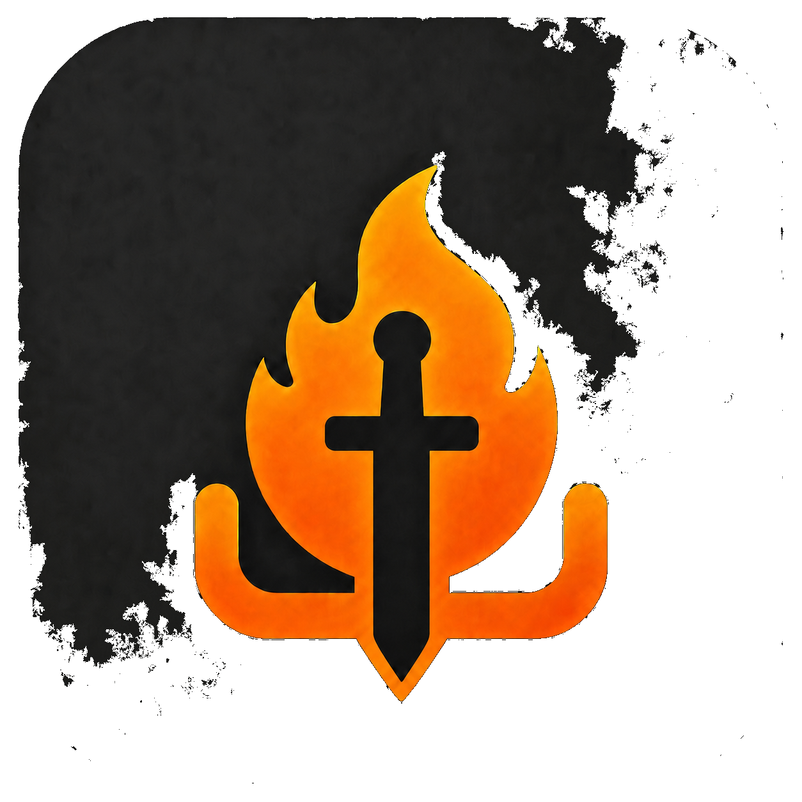
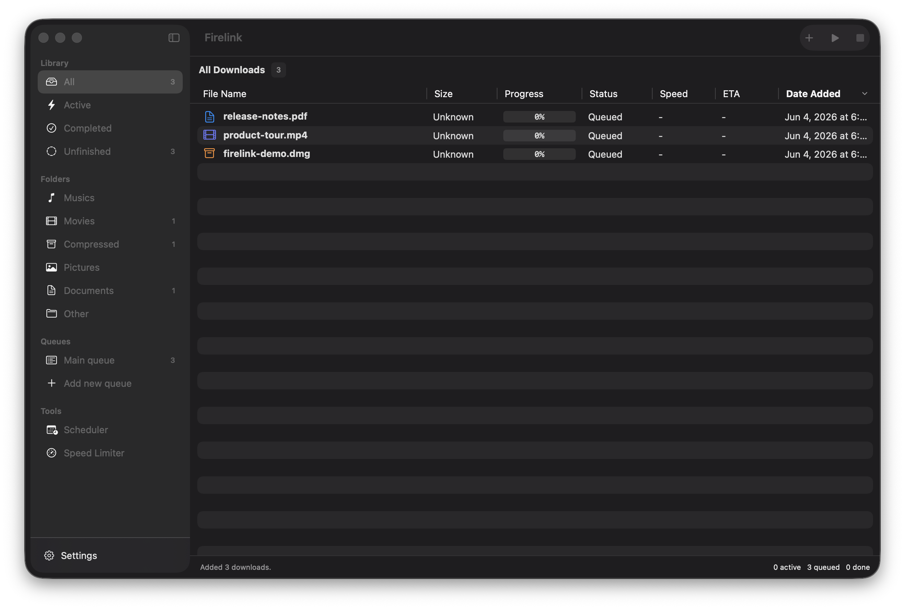
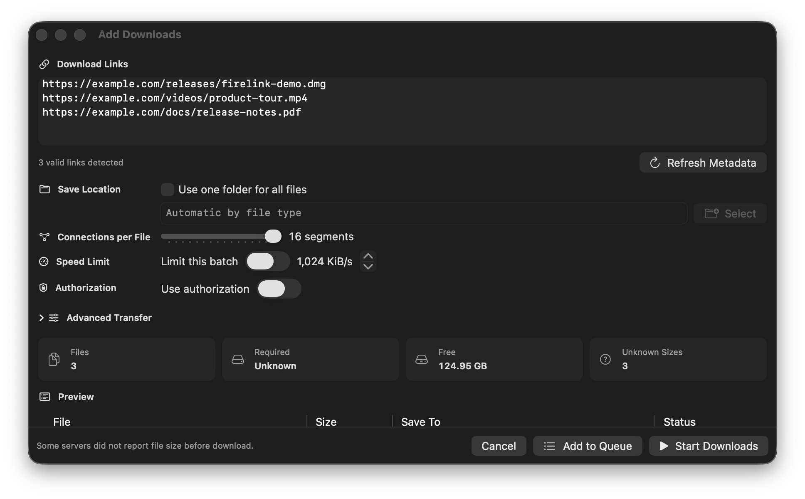
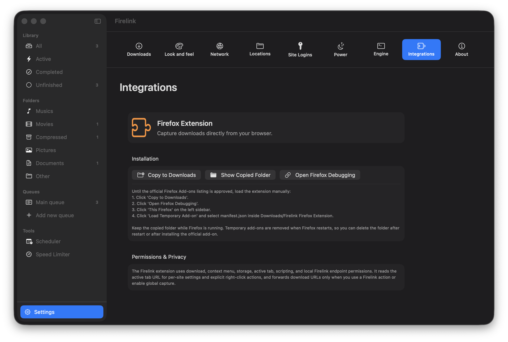
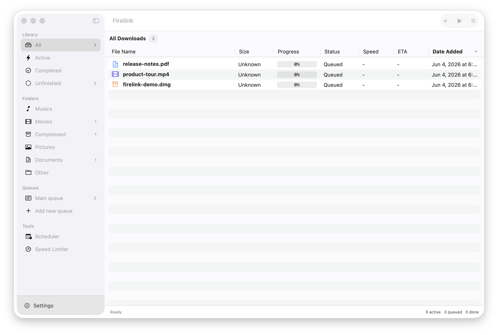
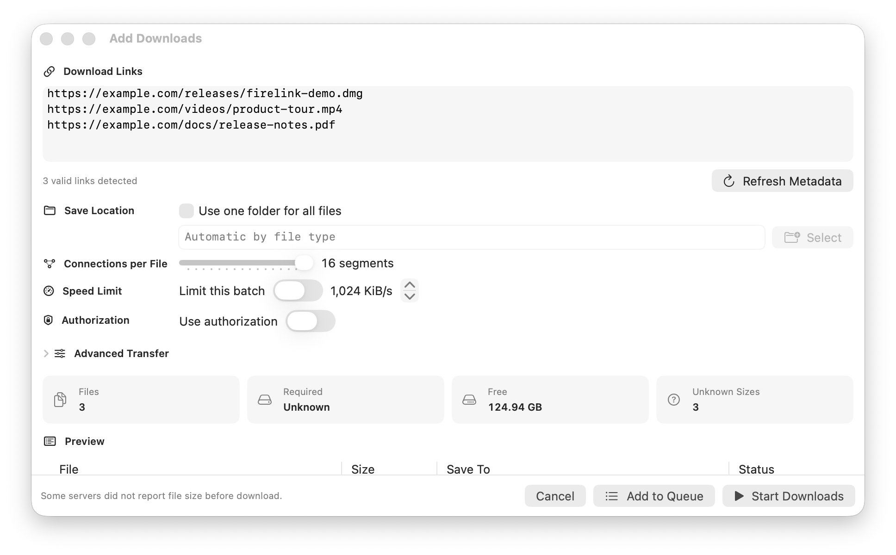
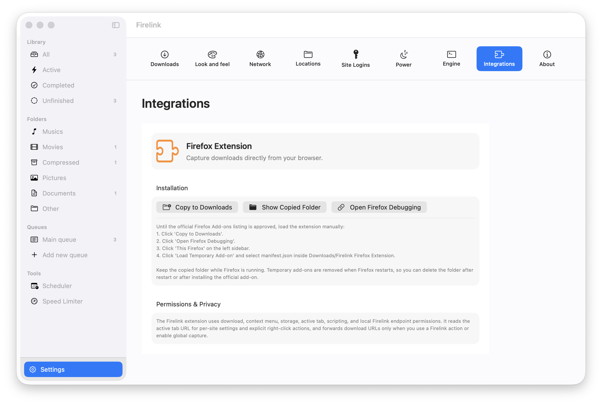

<div align="center">
  
  <h1>Firelink</h1>
  <p><strong>A clean, native SwiftUI download manager for Apple Silicon macOS</strong></p>

  <a href="https://swift.org"></a>
  <a href="https://apple.com"></a>
  <a href="https://aria2.github.io/"></a>
  <a href="LICENSE"></a>
</div>

---

**Firelink** brings the efficiency of multi-segmented download managers (like IDM or FDM) to macOS with a modern, native SwiftUI interface. Designed specifically for Apple Silicon, it delivers high-speed concurrent transfers, drag-and-drop queue control, automated file organization, and Keychain-secured authentication—all in a lightweight native package.

---

### 📸 Screenshots

Dark mode is shown by default with privacy-safe example downloads. Light mode is tucked away below so the README stays easy to scan.

<div align="center">
  
  
  
  <br/>
  <sub>Main window, batch link intake, and Firefox integration setup</sub>
</div>

<details>
<summary><b>☀️ View Light Theme Screenshots</b></summary>
<br/>
<div align="center">
  
  
  
  <br/>
  <sub>Main window, batch link intake, and Firefox integration setup in light theme</sub>
</div>
</details>

---

## ✨ Features

- ⚡ **High-Speed Downloads:** Multi-segmented engine powered by `aria2c`.
- 🎨 **Native SwiftUI:** Responsive Apple Silicon native UI.
- 🎯 **Chunk Map Inspector:** Visually monitor active segment connections in real time.
- 🗂️ **Smart Categories:** Automatic file organization (`Musics`, `Movies`, `Compressed`, etc.).
- 🖱️ **Drag-and-Drop:** Import URLs, text files, and move queued downloads between queues.
- 🛡️ **Reliability:** Automatic download recovery and retry handling.
- 🔒 **Keychain Security:** Local macOS Keychain integration for site credentials.
- ⚙️ **Power & Settings:** Cross-platform styled Settings UI, live Speed Limiter, and system sleep prevention during active downloads.

---

## 🛠️ Quick Start

**OS Support:** macOS 14.0 or newer (Apple Silicon natively).

Run the application directly:
```bash
swift run Firelink
```

Or build a production `.app` bundle:
```bash
make app && open build/Firelink.app
```

---

## 🧩 Browser Extension

Find the companion browser extension (Firefox) at:
👉 **[nimbold/Firelink-Extension](https://github.com/nimbold/Firelink-Extension)**

---

## 🗺️ Roadmap

- [x] Zero-Config `aria2c` bundling.
- [x] Global & per-download Speed Limiter.
- [x] Browser Extensions support.
- [x] In-app integrated Settings UI.
- [ ] Notarized `.app` releases and Homebrew formulae.

---

## 🏆 Credits

Firelink relies on [aria2](https://aria2.github.io/) as its underlying multi-protocol and multi-source command-line download utility. Special thanks to the aria2 contributors for their excellent engine.

---

## 📄 License

Firelink is released under the MIT License. See [LICENSE](LICENSE) for details.
